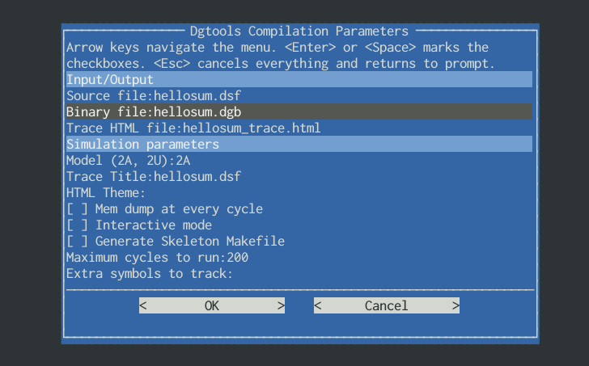
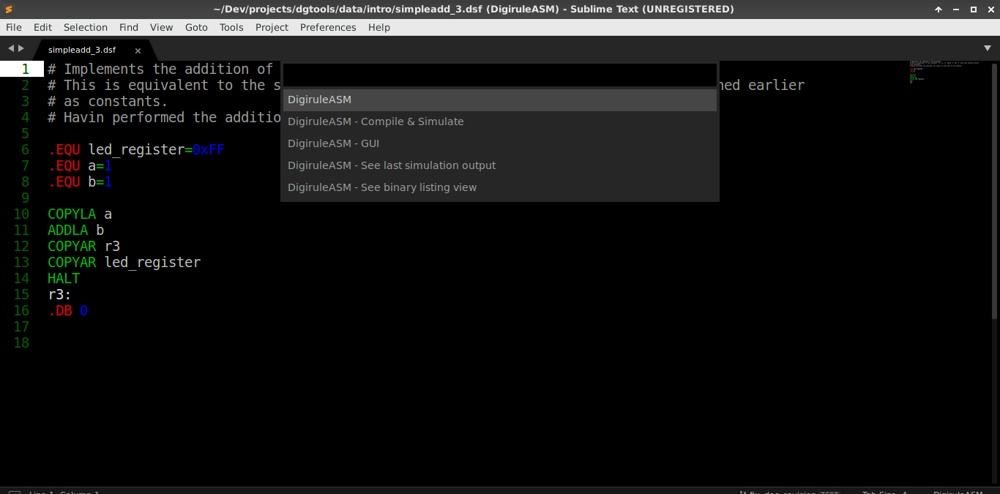
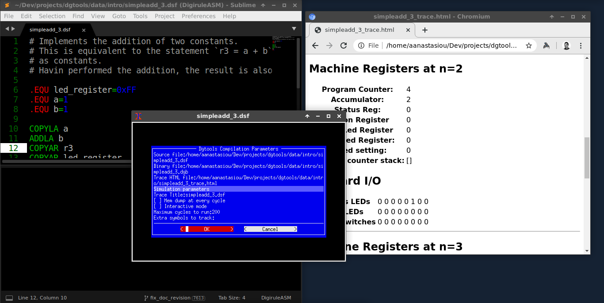

Extra functionality
===================

Compiling via ``dgui.py``
-------------------------

``dgtools`` is composed of three simple programs that work together to compile, simulate and inspect 
software for the Digirule.

To make these more user friendly, ``dgtools`` incorporates a text based graphical user interface that gathers 
input from the user and orchestrates the rest of the build process. A screenshot of that is available in 
the following figure:

    The ``dgui.py`` script invoked on ``simpleadd_1.dsf`` through a relative path.
    
The ``dgui.py`` can be invoked at any point in the filesystem and only requires that the ``.dsf`` file that is 
passed at its input is an existing Digirule Source File.

Once the parameters are set to the desired values, use the arrow keys to select ``<OK>``, click enter and see 
output for any messages on the compilation process either from ``dgasm.py`` or ``dgsim.py``.

The ``dgui.py`` can also be invoked through the ``DigiruleASM`` build environment within the Sublime text editor.

``DigiruleASM`` build package for Sublime Text
----------------------------------------------

`Sublime Text <https://www.sublimetext.com/>`_ is a fantastic editor and through the use of packages it can morph 
into a minimal but powerful development environment.

``dgtools`` includes a ``DigiruleASM`` build package (in ``extras/DigiruleASM.zip``) that once installed can 
recognise ``.dsf`` files...

.. figure:: figures/fig_st_build_env_ss.png

    ``simpleadd_3.dsf`` through the eyes of the ``Digirule2ASM`` package...
    

...and offers a basic set of compilation options, right from the editor that can be selected 
through ``Ctrl + Shift + B``.

    About to compile the code
    

    After code compilation, the ``DigiruleASM`` automatically launches the browser to see the output of simulation.

Styling trace files
-------------------

Trace files can be styled by adding a ``dgtheme.css`` CSS file, in the same directory with the HTML file of the trace.

Linking to trace files
----------------------

Trace files contain "named anchors" right at the beginning of each "Machine State" heading. These ``a`` tags 
are prefixed with ``n`` followed by the clock-cycle number so you can link directly to a specific state even 
within longer traces.

Say for instance you have a file up on `jsbin.com <http://www.jsbin.com>`_ and something...exciting (?) is 
hapenning at ``n=2``, you can link directly to that state with `<https://output.jsbin.com/huluzil/1#n2>`_ . 
Notice the ``#n2`` right at the end of that URL and where the browser opens the document by default.
