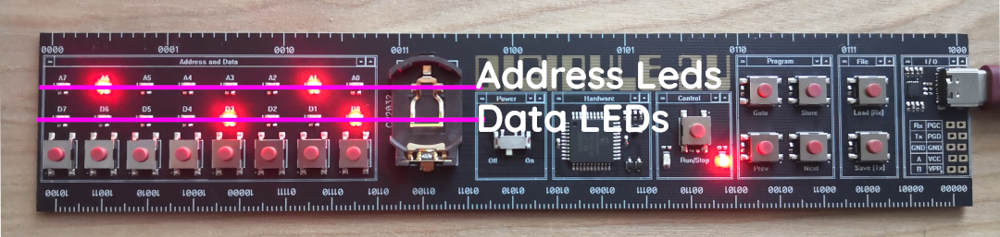

Heads Up Display
================

This is a short note on how to turn your Digirule 2U to an auxiliary little display for up to 2 different parameters.

You can use it to display all sorts of things such as your battery charge level, whether you have new email and any 
other "event" you can describe with an integer number from 0 to 255.

Here is what we are aiming for:

.. raw:: html
    
    <iframe width="560" height="315" src="https://www.youtube.com/embed/xsmHa0TSajQ" frameborder="0" allow="accelerometer; autoplay; clipboard-write; encrypted-media; gyroscope; picture-in-picture" allowfullscreen></iframe>

What is the display?
--------------------

Every Digirule, from version 2 to 2U is equipped with two rows of LEDs:

1. The upper row, labeled ``A7, A6, A5...A0``, which is normally used to display the current memory address in binary; and
2. The lower row, labeled ``D7, D6, D5...D0``, to display the byte value at the current memory address, also in binary.

.. _fig_addr_data_leds:

    
    The Digirule 2U with its two LED "bars" formed by the address and data leds.

When the Digirule powers up, the default behaviour is to have the address LEDs to be showing the current memory address.

It is however possible, to also control them by setting the third bit of the status register to ``1``; and
writing the byte value to depict at address ``254``.

Driving the data LEDs is much more straightforward, by just writing the BYTE value to address 255.

These two rows of LEDs can be used to display a binary number or they can be used as two "bar" displays, depicting a 
bar filling up by depicting the numbers ``1, 3, 7, 15, 31, 63, 127, 254``.

So, the main idea is to write a program that displays the two numbers to the displays and when data becomes available 
on the serial port, it reads it in and goes back to displaying them.

But how do we select the display and send those numbers in?

What are its commands?
----------------------

Our little display is built around a very very simple protocol: ``/<display><number>``. 

``/`` is used as the starting character. This notifies the code to read in the next value which here is either a ``0`` or 
``1`` and this corresponds to which bar to set. 

Send ``/0`` to select the Data LED bar, or ``/1`` to select the 
address LED bar. The final step is to read in the BYTE value which is an integer number from 0 to 255.

So, to set the Data LED bar so that it appears 50% lit (just 4 LEDs being lit), we would send ``/0015`` and similarly,
to send the same value to the Address LED bar we would send ``/1015``.

To simplify things, the BYTE value to be depicted to the LEDs must be 3 digits long. Which means that if you wanted to 
send ``0``, you really have to send ``000``.

This brings about an interesting point about this little demo because to an extend, it is identical to 
:ref:`itoa`.

This is because, we want to be able to send the number to the display in human readable form and this means that it will 
have to be in "ASCII". That is, instead of sending ``A`` (which represents the number 65), we would be sending ``065`` and
this means that before storing the value ``65``, we need to calculate 
:math:`(\text{byte}_0 - 48) \cdot 100 + (\text{byte}_1 - 48) \cdot 10 + (\text{byte}_2 - 48)`.

The reason we are subtracting ``48`` here, is because ``48`` is 
`the ASCII code <https://en.wikipedia.org/wiki/ASCII#Printable_characters>`_ that corresponds to the **symbol** that 
we know as zero.

So, the interpretation of ``065`` simply boils down to evaluating 
:math:`(48 - 48) \cdot 100 + (54 - 48) \cdot 10 + (53 - 48)` prior to storing the 
received value (:math:`65`) to either the upper or lower display.

Knowing how this is handled now only leaves putting it together with communications...

How to handle the communication?
--------------------------------

The logic for this is very simple. For 99% of its running cycle, the progam reads the two values to depict from memory 
and sends them to the LED displays.

Without communications, this is really straightforward:

.. code-block:: DigiruleASM
    :linenos:
    
    .EQU status_reg=252
    .EQU addr_led_bit=2
    BCLR addr_led_bit status_reg # Enable control of the Address LEDs
    
    display_values:
    COPYRR M1 254
    COPYRR M2 255
    JUMP display_values   # For ever display M1 and M2
    
    M1:
    .DB 32
    M2:
    .DB 16
    
And, when the time comes to update the values, the program needs to jump out of its display loop, check if the received 
message fits the protocol, receive the string, do any necessary conversions and go back to displaying the new values.

It probably reads much more complicated than it really is.

The main loop remains the same, but we now add a ``COMRDY`` to check if a message is being received: 

.. code-block:: DigiruleASM
    :linenos:

    # ...
    # ...
    
    check_input:
    COMRDY
    BCRSS zero_bit status_reg # If data is received COMRDY marks the  
    JUMP load_new_values      # Zero flag and, here, branches out to load_new_values
    display_values:
    COPYRR M1 255
    COPYRR M2 254
    JUMP check_input
    
The next part is simply reading in bytes and converting them to a number:

.. code-block:: DigiruleASM
    :linenos:
    
    # ...
    # ...
    
    load_new_values:
    BCLR carry_bit status_reg
    COMIN
    SUBLA 47                    # Is it the / character?
    BTSTSS zero_bit status_reg
    JUMP display_values         # If not go back to displaying the values
    BCLR carry_bit status_reg
    COMIN
    SUBLA 48
    BTSTSC carry_bit status_reg  # Is the display a positive number?
    JUMP display_values
    ADDLA M1
    COPYAR R0
    BCLR carry_bit status_reg
    COMIN                       # Receive the first byte...
    SUBLA 48
    COPYAR R1
    COPYLR 100 R2               # Multiply by 100
    MUL R1 R2
    COMIN                       # Receive the second byte...
    SUBLA 48
    COPYAR R2
    COPYRA R1
    COPYLR 10 R1                # Multiply by 10
    MUL R2 R1
    ADDRA R2                    # Add it to the previous product
    COPYAR R2
    COMIN                       # And finally receive the third byte
    SUBLA 48
    ADDRA R2                    # And add it to the previous sum.
    COPYAI R0                   # Now transfer the result to either M1 or M2
    JUMP display_values         # Get back to the main loop
    

And that is basically it. The only other thing that this code does is deciding whether to send 
the received and converted value to M1 or M2 depending on the bar selection number (the first 
value right after ``/``).

Here is the complete code listing from ``dg_asm_examples/hud/``.

.. literalinclude:: ../../dg_asm_examples/hud/rhud.dsf
    :language: DigiruleASM
    :linenos:

How to communicate with it from another computer?
-------------------------------------------------

Driving the display from another computer is really straightforward and ideally, it involves:

1. Setting up the communications port parameters (More importantly speed)
2. Sending a message to the communications port.

And all the "complexity" is then due to the way different operating systems access the port. 

Here is how to do it on Linux:

If you don't know which "device" your Digirule 2U listens on:

1. Plug the Digirule 2U in
2. Find out which device file corresponds to the serial port
    a. The easiest way to do this is by ``> dmesg|egrep FTDI`` [#f1]_ to which your OS will respond with something like
       ``[ 6093.755022] usb 2-2: FTDI USB Serial Device converter now attached to ttyUSB0``. 
    b. From this we know that the serial port the Digirule 2U is connected on is at ``/dev/ttyUSB0`` [#f2]_.
3. Make sure that you can write to the serial port
    a. By default, the serial port's access rights might be restricted. But since we know that the only thing that 
       is attached to this serial port is the Digirule 2U, we can go ahead and allow read/write access to it with:
       ``> sudo chmod o+rw /dev/ttyUSB0`` [#f3]_.

Once you know which "device" the Digirule 2U uses:

1. Set the communications port parameters
    a. The simplest way to do this is with ``> stty -F /dev/ttyUSB0 9600``
    
2. Send a message to the port
    a. The simplest way to do this is with ``> echo "/0127" > /dev/ttyUSB0``
    

You might think that this is complicated but it is really worth the effort when you consider that on this operating 
system, you can obtain information about every single part of its functionality.

So, let's use this program to display the percentage of charge in a laptop's battery.

Putting it all together
-----------------------

On Linux, you can get this figure via `upower <https://en.wikipedia.org/wiki/UPower>`_ which is the power management 
software layer.

To obtain the exact "tag" of your battery power source, first run a:

::

    > upower -e
    

Which will produce an enumeration similar to:

::

    > /org/freedesktop/UPower/devices/line_power_AC
    > /org/freedesktop/UPower/devices/battery_BAT0
    > /org/freedesktop/UPower/devices/DisplayDevice

These are all the devices that can be controlled via upower. 

.. note::
    On a desktop computer, it is unlikely that the battery "path" will be there, but 
    you can query and select another parameter to display. The main idea is still the same.

To obtain information about ``battery_BAT0``, run a:

::

    > upower -i /org/freedesktop/UPower/devices/battery_BAT0

This returns a large amount of information about the battery, similar to:

:: 

      native-path:          BAT0
      vendor:               Something
      model:                Something else
      serial:               7518
      power supply:         yes
      updated:              <Some date> ( N seconds ago)
      has history:          yes
      has statistics:       yes
      battery
        present:             yes
        rechargeable:        yes
        state:               discharging
        warning-level:       none
        energy:              21.318 Wh
        energy-empty:        0 Wh
        energy-full:         41.2566 Wh
        energy-full-design:  51.3 Wh
        energy-rate:         4.104 W
        voltage:             11.29 V
        time to empty:       5.2 hours
        percentage:          51%
        capacity:            80.4222%
        technology:          lithium-ion
        icon-name:          'battery-good-symbolic'
      History (charge):
        1608420725	51.000	discharging
      History (rate):
        1608420725	4.104	discharging    
        
To "isolate" the "percentage" figure, we will use a `regular expression <https://en.wikipedia.org/wiki/Regular_expression>`_
, via `grep <https://en.wikipedia.org/wiki/Grep>`_. To do this, run a:

::

    > upower -i /org/freedesktop/UPower/devices/battery_BAT0|egrep "percentage"|egrep "[0-9]+" -o

Here, we are sending the output of ``upower`` to ``egrep`` (using the ``|`` (pipe) character [#f4]_ ) to filter out 
the line of text that includes "percentage:        51%" and the output of that to another filter that only preserves 
strings that include one or more 
digits. The combined result of this is the number 51 (*without* the ``%`` sign).

Now, what we want to send to the Digirule 2U is ``/0051``. We can format our number in this way by using 
`printf <https://en.wikipedia.org/wiki/Printf_(Unix)>`_. To do this run a:

::

    > printf '/0%03d'  `upower -i /org/freedesktop/UPower/devices/battery_BAT0|egrep "percentage"|egrep '[0-9]+' -o`
    
The format string is `identical to C's printf <https://en.wikipedia.org/wiki/Printf_format_string#Type_field>`_. 
The other thing to notice here is the **backticks** used in the ``upower`` command which 
**first evaluate their content** and substitute it with the result.

This means that ``printf`` is asked to format **the result** of ``upower`` (51) as a string starting with ``/``, 
followed by our "channel selector", here ``0``, followed by the charge percentage formated **always** as a 3 digit 
number. This last detail is very important to keep our decoding process simple.

All that we would be missing now is sending this result to the Digirule 2U running our Heads Up Display program.

To do this, run a:

::

    printf '/0%03d'  `upower -i /org/freedesktop/UPower/devices/battery_BAT0|egrep "percentage"|egrep '[0-9]+' -o`>/dev/ttyUSB0 >/dev/ttyUSB0

And that is it. The Digirule 2U now displays your battery charge as a binary value.

Conclusion
----------

This is a nice little demo to control the displays of the Digirule 2U from a computer with a very small 
ASM program.

There are several improvements that can be applied around handling "errors" (e.g. malformated strings) but 
these would not change the main idea of operation considerably.

The script that displays the battery charge is also kept as simple as possible. An improvement of it would be 
to convert the binary number to a "bar" display. This only includes finding the power of 2 that is closest to 
the displayed number. For example, for 51, it would have to be 64. Or in other words, shift left 1 by the 
rounded logarithm of base 2 of 51. But, this is only a matter of further processing on the terminal, just before 
using ``printf`` to format the final result and send it to the serial port.

Finally, for a periodic display of the battery power, you can simply add this line to your 
`crontab <https://en.wikipedia.org/wiki/Cron>`_
and have your Digirule2U display your battery power (or any other parameter you wish) at well set intervals.

.. [#f1] `dmesg <https://en.wikipedia.org/wiki/Dmesg>`_ prints out a log of all kernel messages. Every time a USB device 
         is plugged in to a computer it triggers a series of actions from registering its existence to loading the 
         right device driver to make it available to the user. With ``dmesg|egrep FTDI`` we are filtering this log of
         messages for those responses that were due to the FTDI chip that the Digirule 2U uses on its USB port.
         
.. [#f2] The reason a serial port over USB is mapped to ``/dev/ttyUSB0`` is due to the 
         `everything is a file <https://en.wikipedia.org/wiki/Everything_is_a_file>`_ principle of Unix-like operating 
         systems. Viewing devices as files simplifies and abstracts the different ways they are actually accessed by 
         the lower level code. At the level of a user, reading from some ``/dev/camera`` location could well trigger 
         image capturing on a device. The image is captured and sent back to the user who "thinks" they are reading 
         a file. Similarly, anything sent to ``/dev/ttyUSB0`` is sent to the Digirule 2U via its serial port.
         That ``tty``? Yeah, that stands for **TeleTYpewriter**........
         `noisier than a mechanical keyboard <https://www.youtube.com/watch?v=7DpcwhmVaV8>`_
         
.. [#f3] `chmod <https://en.wikipedia.org/wiki/Chmod>`_ changes access permissions on a file. And since
         *everything is a file*, it is possible to control access to devices as well. The reason a serial port might be 
         restricted by default is because usually, serial ports lead to MODEMs...So, to discourage any user from 
         fiddling with a possible communications link, access to serial ports is restricted for simple users.
         This is also why, to change the permissions on the device, we need to use `sudo <https://en.wikipedia.org/wiki/Sudo>`_

.. [#f4] `Piping <https://en.wikipedia.org/wiki/Pipeline_(Unix)>`_ is a fundamental concept and refers to allowing 
         processes to communicate with each other over a very simple text only "channel". 
