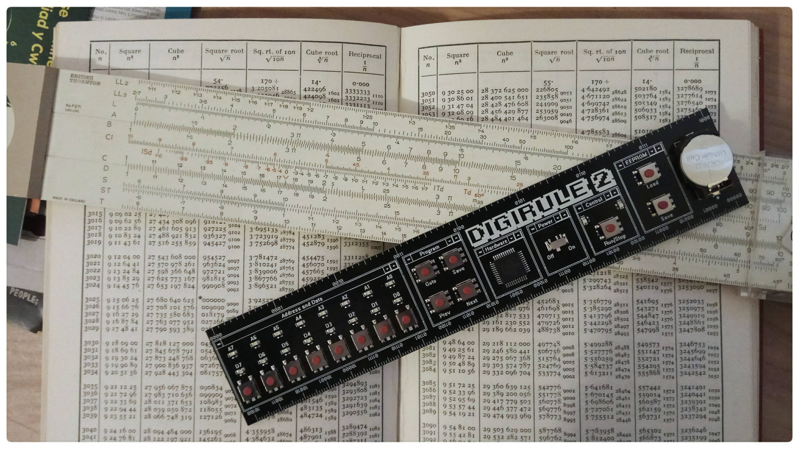

.. dgtools documentation master file, created by
   sphinx-quickstart on Sun Mar 15 12:10:55 2020.
   You can adapt this file completely to your liking, but it should at least
   contain the root `toctree` directive.

Welcome to dgtools's documentation!
===================================

``dgtools`` is composed of an assembler (``dgasm``), a binary file "inspector" (``dginspect``) and a simulator
(``dgsim``) that can be used together to develop code for the `Digirule 2 <https://bradsprojects.com/digirule2/>`_
hardware.

For an example of the level of detail of program execution, please see 
`this sample output file <_static/simpleadd_2_trace.html>`_ and keep reading through the introductory section to 
generate traces of your own code.

.. toctree::
   :maxdepth: 2
   :caption: Contents:

   introductory_topics
   advanced_topics
   digirule2_asm
   instruction_set_notes
   script_detail
   current_todos

Indices and tables
==================

* :ref:`genindex`
* :ref:`modindex`
* :ref:`search`
