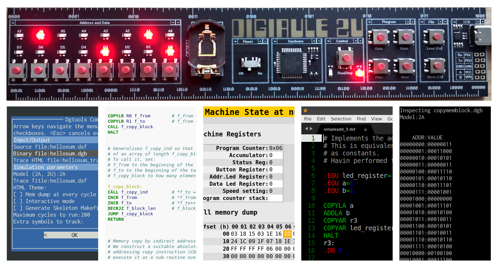

.. dgtools documentation master file, created by
   sphinx-quickstart on Sun Mar 15 12:10:55 2020.
   You can adapt this file completely to your liking, but it should at least
   contain the root `toctree` directive.

Welcome to dgtools's documentation!
===================================

``dgtools`` is a mini-toolchain for compiling and testing ASM programs for the 
`Digirule 2 <https://bradsprojects.com/digirule2/>`_ series of hardware. 

It is composed of an assembler (``dgasm.py``), a binary file "inspector" (``dginspect.py``) and a simulator
(``dgsim.py``) that are used to develop and test code and also assist in transfering the program to the Digirule.

For an example of the level of detail in terms of simulating program execution, please see 
`this sample output file <_static/simpleadd_2_trace.html>`_ and keep reading through the introductory section to 
generate traces of your own code.

Alternatively, you can now try out online any of the examples in these pages via `dgrdo <https://www.dgrdo.org>`_ 
which also exposes the `brainfuck <https://www.dgrdo.org/bf>`_ and `Super Stack! <https://www.dgrdo.org/sust>`_ compilers included with ``dgtools``.

.. toctree::
   :maxdepth: 2
   :caption: Contents:

   introductory_topics
   advanced_topics
   assembler_syntax
      
   script_detail
   extras
   current_todos
   
   instruction_set_notes
   
   code_projects

Indices and tables
==================

* :ref:`genindex`
* :ref:`modindex`
* :ref:`search`
