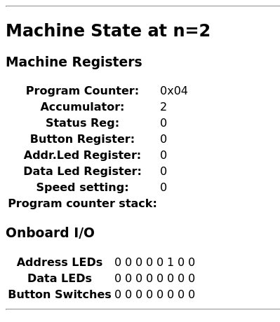
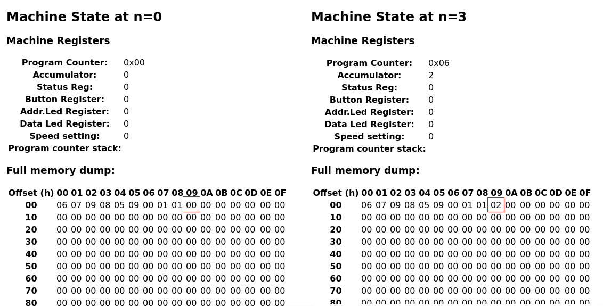
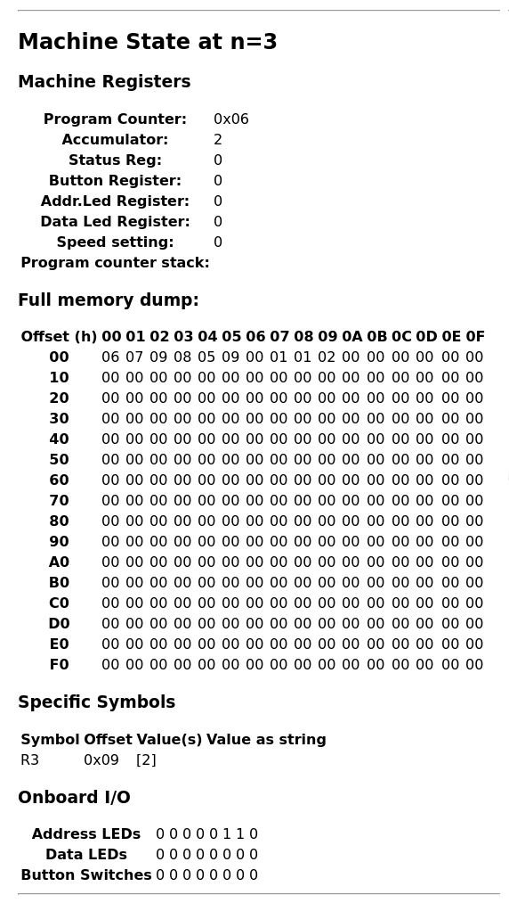
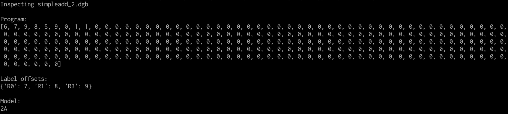
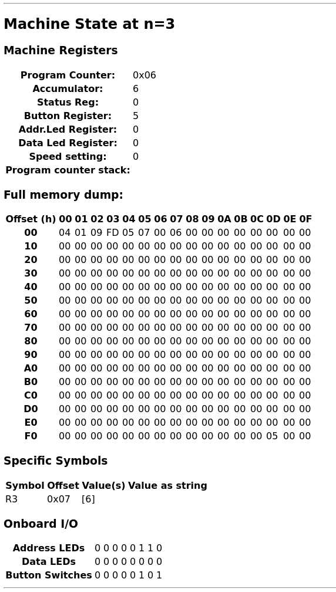

.. _intro-topics:

Introducing ``dgtools``
=======================

The objective of this introductory section is to demonstrate the key use cases of ``dgtools`` by example.

Digirule 2 ASM knowledge is not essential, but a general knowledge of ASM, even at introductory level, would be 
favourable. This walkthrough is based on the very simple example of adding two numbers which, through a number of 
revisions, introduces a feature or capability of `dgtools`. 

Throughout the following section, it is assumed that `dgtools` is installed on a virtualenv, the virtualenv is 
activated and the current working directory is ``dg_asm_examples/intro/``.

Adding two literals
-------------------

Adding two literals is the "Hello World" of Digirule 2 programming. It is a matter of three instructions in 
Digirule 2 ASM:

.. literalinclude:: ../../dg_asm_examples/intro/simpleadd_1.dsf
    :language: DigiruleASM
    :linenos:

Copy literal 1 to the accumulator, add literal 1 to the accumulator and stop.
At the end of this program, we expect the accumulator to have the value ``2``.

To verify this using ``dgtools``, run the following (from within the ``src`` directory):

.. code:: bash

    > dgasm.py simpleadd_1.dsf
    > dgsim.py simpleadd_1.dgb
    
    > xdg-open simpleadd_1_trace.html

If you are on Linux, the line begining with ``xdg-open`` will open the HTML file with whatever browser you have installed
on your system. If you are on Windows, substitute `xdg-open` with `start` to achieve the same.

Browsing through the generated trace file (``simpleadd_1_trace.html``) all the way down to the final time step, you can 
confirm the value that the accumulator holds.

.. _fig_intro_add_1:

    
    The final state of the "Hello World" program trace. The result of the computation (2) 
    is in the Accumulator.

.. _simple_add_with_mem:

Adding two literals saving the result to memory
----------------------------------------------- 

Leaving the result of the addition in the accumulator is fine, but more commonly these results would have to be shifted
out to some memory location (also known as a "variable").

Our new listing is now:

.. literalinclude:: ../../dg_asm_examples/intro/simpleadd_2.dsf
    :language: DigiruleASM
    :linenos:

Here, there are three labels (``R0, R1, R2``) that simply "tag" three locations in memory that hold initial literal 
values (``1, 1 ,0`` respectively).

These values are *hard coded* into the program here and will end up somewhere in memory. To get a full dump of the 
memory space at **every** time step of execution, we will need to run ``dgsim`` with an extra parameter. 

The complete workflow is as follows:

.. code:: bash

    > dgasm.py simpleadd_2.dsf
    > dgsim.py simpleadd_2.dgb --with-dump

That second line will generate `simpleadd_2_trace.html`. If you open it with your browser and scroll all the 
way to the end you can see that where before there was a zero, now there is a 2.

.. _fig_intro_add_2:

    
    Initial and final states of the addition of two numbers. In this version, the result of the computation (2)
    has been shifted out to memory address `0x09` which started with an initial value of 0 and ended up with 
    the value of 2. Also, notice the value of the Accumulator which is still 2, since it has not been cleared.

A more convenient way to monitor the values of specific memory locations (e.g. ``R3``) is to tell ``dgsim`` to 
*track that symbol* throughout the execution of the program. This now helps in introducing the ``-ts`` parameter to 
``dgsim``:

.. code:: bash

    > dgasm.py simpleadd_2.dsf
    > dgsim.py simpleadd_2.dsf --with-dump -ts R3
    
Which produces a ``simpleadd_2_trace.html`` with all the changes of ``R3``:

.. _fig_intro_add_2_2:

Introducing ``dginspect``
^^^^^^^^^^^^^^^^^^^^^^^^^

This is a good point in the workflow to introduce the ``dginspect`` tool for inspecting already compiled programs and 
tracking labels.

``dginspect`` provides a complete "dump" of a ``.dgb.`` archive. That is, it provides a complete listing of all the 
information about a given program that is captured within the ``.dgb`` archive. 

It can be called by:

.. code::bash

    > dginspect.py simpleadd_2.dgb

Which produces:

.. _fig_intro_add_2_3:

    ``dginspect`` provides an X-Ray view of a ``.dgb`` archive, including a list of the defined labels 
    and their offsets within Digirule's memory.

For a more detailed explanation of how to use ``dginspect`` to track symbols, you might want to come back to 
:ref:`this section in the appendix <appendix_dginspect>`.

Adding two literals, sending the output to the Data LEDs
--------------------------------------------------------

Certain registers of the Digirule 2 are memory mapped. For example, the Data LEDs are accessible at address 255.
``dgasm`` allows the definition of "symbols" that resolve to specific expressions. At the moment, "symbols" are used to
define numeric constants, but in the future, these symbols might expand to whole expressions, akin to C's macros. 

Defining constants in this way does not take up any memory space. When the assembler comes across a "symbol", 
it simply substitutes its value.

The code now is:

.. literalinclude:: ../../dg_asm_examples/intro/simpleadd_3.dsf
    :language: DigiruleASM
    :linenos:

This program can be tried out in one of the ways that were explained previously. 

.. note::
    It would be useful to note here the difference between a "Label" and a "Symbol". The **value** of a label is the 
    address it points to in memory. The **value** of a symbol is the literal that was assigned to it through the 
    ``.EQU`` directive.

Keying the program in
^^^^^^^^^^^^^^^^^^^^^

Since this program now produces some sort of visible output we can try to "key it in" to the Digirule 2. 

To make this process easier, ``dginspect`` includes the ``-b`` option that "dumps" the complete assembled memory 
region as pairs of ``ADDR:VALUE`` values *formatted in binary*. 

To key the program in, just make sure that a given memory address on 
the Digirule2 (indicated by the A0-7 LEDs) maps to the corresponding ``VALUE`` (indicated by the D0-7 LEDs).

To see what this looks like:

.. code:: bash

    > dginspect.py simpleadd_3.dgb -b
    
This will simply dump everything to ``stdout``, which means that it can be stored to be reviewed later with:

.. code:: bash

    > dginspect.py simpleadd_3.dgb -b>add3_bin_output.txt
    
Or, if you are in Linux, simply send it to `less <https://en.wikipedia.org/wiki/Less_(Unix)>`_ with:

.. code::

    > dginspect.py simpleadd_3.dgb|less

In either case, the binary dump for ``simpleadd_3.dgb`` would look like this:

.. code::
    
        ADDR:VALUE   
    00000000:00000100
    00000001:00000001
    00000010:00001000
    00000011:00000001
    00000100:00000101
    00000101:00001001
    00000110:00000101
    00000111:11111111
    00001000:00000000
    00001001:00000000
    00001010:00000000
    00001011:00000000
    ...
    ...
    ...
    ...
    ...

Adding a literal and a user supplied input
------------------------------------------

The Digirule 2 has an elementary input device, a keyboard, attached to the CPU at address ``253``. Reading that 
"register" allows the program to read user input in the form of a binary number. 

The Digirule 2 Virtual Machine includes a flexible mechanism that is called *interactive mode* that allows the 
simulation to take user input into account. 

This is specified to ``dgsim`` with option ``-I``.

The code listing for this example is as follows:

.. literalinclude:: ../../dg_asm_examples/intro/simpleadd_4.dsf
    :language: DigiruleASM
    :linenos:

The compilation process is now:

.. code::

    > dgasm.py simpleadd_4.dsf
    > dgsim.py simpleadd_4.dgb -I

With ``-I``, once the Digirule CPU tries to read from memory address ``253`` (or, ``0xFD``), a prompt will pop up for
a **binary** input (i.e `0b00000010`) which the program then adds 1 to and stores to the memory location labeled ``R3``.

Here is the output with ``0101`` (i.e. ``5``), as the input.

.. _fig_intro_add_4:

    Passing ``5`` in interactive mode is visible at row ``0xF0``, column ``0x0D`` (or address ``0xFD``). The program 
    adds 1 and stores the value in ``R3``.

.. _cplx_intro_example_5:

Adding two literals with command line parametrisation
-----------------------------------------------------

It probably has become apparent by now that ``dgsim`` can operate as a separate virtualised computing unit for Digirule
hardware. 

It can run programs and save its final state and it also provides ways of extracting those values from its memory space.

In fact, it is possible to *parametrise* Digirule 2 programs, call them and then extract values from the final memory 
space as follows:

.. literalinclude:: ../../dg_asm_examples/intro/simpleadd_5.dsf
    :language: DigiruleASM
    :linenos:

This program specifies 1 byte ``a,b`` which hold literals that participate in addition and ``R3`` that 
points to a one byte memory location that receives the result of the addition.

Very briefly, ``a,b`` will become the **parameters** (two numbers that can be reset **without recompiling the program**) 
and ``r3`` will be the memory location that holds the final result.

The complete workflow is as follows, notice here *which .dgb file is inspected for the results of the calculation*:

1. Compile the program
    * ``> dgasm.py simpleadd_5.dsf``
2. Run the program
    * ``> dgsim.py simpleadd_5.dgb``
3. Inspect the **result** as stored in `R3`
    * ``> dginspect.py simpleadd_5_memdump.dgb -g r3``
        * Notice here, we inspect the ``*_memdump.dgb`` file which is the final state of the program, at the end of 
          the simulation.
    * With the program in its original form, this value should be ``8``.
4. **Change parameter a to 3**
    * ``> dginspect.py simpleadd_5.dgb -s 8 3``
    * Don't worry about overwriting ``simpleadd_5.dgb``, its original form is still maintained in a ``.bak`` file.
    * Notice here that `8` is the offset of variable `a`
5. Run the program again
    * ``> dgsim.py simpleadd_5.dgb``
6. Inspect the final result now
    * ``> dginspect.py simpleadd_5_memdump.dgb -g r3`` 
    * With the parameters given here, this value should be ``9``
    
7. Start keying the final result in with:
    * ``> dginspect.py simpleadd_5_memdump.dgb -b``
    

This is probably the most involved workflow using ``dgtools`` to take full control of program execution.

Each one of the three tools has more capabilities that were not expanded upon here but can be reviewed with ``--help``.
For more information please see section :ref:`detailed_script_descriptions`.

With these points in mind, it is now time to move to :ref:`advanced topics <advanced-topics>` demonstrating more 
complex code on the Digirule 2.

--------

.. _appendix:

Appendix: 
---------

.. _appendix_dginspect:

Tracking symbols and ``dginspect``
^^^^^^^^^^^^^^^^^^^^^^^^^^^^^^^^^^

There is a little bit more to the way tracked symbols are specified. You can practically track the values of 
any region in memory, following the syntax ``-ts <symbol-name>[:Length[:Offset]]``. Here is what this means:

#. ``-ts symbol-name``
    * In this case, ``dgsim`` assumes that you are refering to an existing label defined in the program as a
      memory location that spans the length of just 1 Byte. 
      If the label ``symbol-name`` does not exist in your program, this is flagged as an error.
      
#. ``-ts symbol-name:Length``
    * Similar to the first case, but with this syntax, the length of memory that is tracked is ``Length`` bytes long 
      (instead of the default ``1``).
      Again, the label ``symbol-name`` must be defined by your program, otherwise it is flagged as an error.
      
#. ``-ts symbol-name:Length:Offset``
    * This is the most general case where any memory location that starts at ``Offset`` and spans ``Length`` bytes
      can be tracked.
      In this case, ``symbol-name`` is just a "tag" to differentiate tracked locations and it does not have to be 
      defined by the program.
      
To discover the label names and their offsets as defined within a compiled program, you can use ``dginspect`` in the 
following way:

#. Compile the program: 
    * ``> dgasm.py simpleadd_2.dsf``
#. Use ``dginspect`` to obtain all defined symbols and their addresses:
    * ``> dginspect.py simpleadd_2.dgb``
    * This produces:
    
      .. _fig_intro_add_2_3_2:
      .. figure:: figures/fig_intro_add_2_3.png
        
        ``dginspect`` provides an X-Ray view of a ``.dgb`` archive, including a list of the defined labels 
        and their offsets within Digirule's memory.

#. Run ``dgsim`` telling it to "track" some symbols (e.g. ``R2, R3``):
    * ``> dgsim.py simpleadd_2.dgb -ts R3 -ts R2``

Adding multiple ``-ts`` options, keeps adding named references for ``dgsim`` to track. For example, suppose we wanted 
to track all three memory locations, then step 3 would become: 

``> dgsim.py simpleadd_2.dgb -ts R0 -ts R1 -ts R3``

A complete example of the sort of output produced by ``dgsim`` for this file is availe through  
`this link <_static/simpleadd_2_trace.html>`_.
